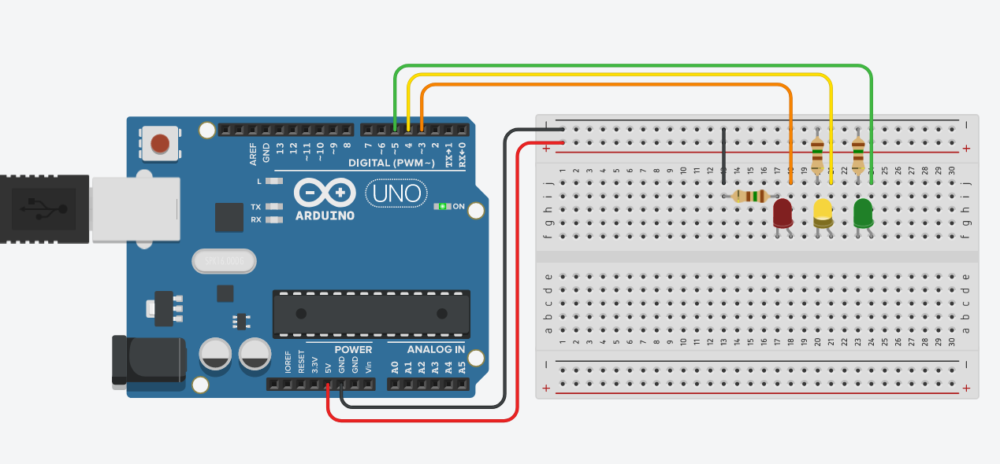

# Изучаем цифровой вывод - digitalWrite:

digitalWrite ~= включить или выключить пин, т.е. подать 5 вольт или подать 0 вольт.

Пример: по очереди зажигаем и тушим светодиоды

Самостоятельная работа: модифицировать программу, чтобы светодиоды зажигались как на светофоре, т.е. не зеленый-желтый-красный, а зеленый-желтый-красный-желтый-зеленый

