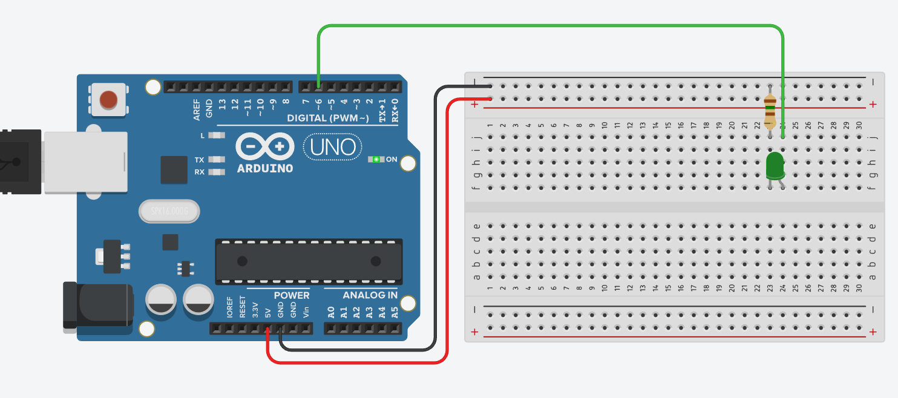

# Изучаем ШИМ - analogWrite:

### Теория:

На прошлом занятии мы научились мигать светодиодами в среде тинкеркад и создали простой светофор:

[код](https://github.com/Ni3nayka/microcontroller_learn_1523/blob/main/2023_12_13-digitalWrite/2023_12_13-digitalWrite.ino)

Но зачастую требуется чтобы светодиод не только включался и выключался (как на светофоре) а еще и включался с определенной яркостью. Возникает вопрос, как это сделать. Самый очевидный вариант – подавать меньшее количество вольт на светодиод, т.к. чем меньше вольт приходит на светодиод, тем слабее он горит, чем больше, тем сильнее он горит. Но есть неприятный момент - контроллер ардуино уно не умеет управлять вольтажом, который она подает с пина, а может выдавать ровно 5 вольт, ни больше, ни меньше (т.е. мы можем только включить и только выключить светодиод). Итак задача выглядит следующим образом – нам нужно управлять яркостью светодиода, с помощью пина, который умеет только включать и выключать светодиод. И такое решение есть, оно называется ШИМ (широтно импульсная модуляция):(посмотрите видеоролик с начала и до 3:40) https://www.youtube.com/watch?v=FGV1snPOcas
Если резюмировать теорию из видеоролика, то если мы будем очень быстро включать и выключать пин ардуинки со светодиодом, то мы будем видеть яркость, полученную от среднего арифметического времени горения ко всему времени цикла. Т.е. светодиод включается и выключается тысячи раз в секунду, и если он 10 процентов времени горит, а остальные 90 не горит, то человек будет видеть яркость в 10 процентов (т.к. мы не можем увидеть мерцание светодиода, если он мигает тысячи раз в секунду). Соответственно, если светодиод половину времени (50 процентов) горит, а остальное время не горит, то человек увидит как светодиод горит «с половинной яркостью». Таким образом, меняя количество времени горения светодиода, и включая-выключая его тысячи раз в секунду, мы видим не мерцание а горящий светодиод с какой-то яркостью. Чтобы нам самим вручную не прописывать такой режим работы, мы будем использовать ШИМ пины ардуино (PWM), это пины под номерами 3,5,6,9,10,11 - т.е. все пины со значком '~' (тильда). Только эти пины на ардуино уно обладают встроенным ШИМ (если например хотим ШИМ на других пинах, то придется это делать самим).

### Практика:

Создайте новый проект (схему) в тинкеркад и соберите следующее:

Обращаем внимание, что ШИМ пины, это тоьлко пины со значком тильды '~'. Напишем для теста программу как в предыдущем занятии:
```
// создаем константы, в которые записываем, 
// к какому пину подключен какой светодиод
// *константы принято называть капсом
const int LED_GREEN = 6;  // пин зеленого светодиода

// подпрограмма setup, вызывается в самом начале один раз 
// (как main)
void setup() {
  // Настраиваем пины, к которым подключены светодиоды, 
  // как пины вывода (управления) - OUTPUT
  pinMode(LED_GREEN,OUTPUT);  // пин зеленого светодиода
}

// подпрограмма loop, вызывается бесконечное количество раз,
// после завершения подпрограммы setup
void loop() {
  digitalWrite(LED_GREEN,1);  // включаем (1) зеленый светодиод
  delay(1000); // ждем одну секунду (1000 милисекунд)
  digitalWrite(LED_GREEN,0);  // выключаем (0) зеленый светодиод
  delay(1000); // ждем одну секунду (1000 милисекунд)
}
```
В результате у нас должен мигать светодиод, если не мигает, перепроверьте, все ли правильно собрано и все ли правильно написано. Затем помигаем светодиодом уже с использованием ШИМ (управляя яркостью):
```
// создаем константы, в которые записываем, 
// к какому пину подключен какой светодиод
// *константы принято называть капсом
const int LED_GREEN = 6;  // пин зеленого светодиода

// подпрограмма setup, вызывается в самом начале один раз 
// (как main)
void setup() {
  // Настраиваем пины, к которым подключены светодиоды, 
  // как пины вывода (управления) - OUTPUT
  pinMode(LED_GREEN,OUTPUT);  // пин зеленого светодиода
}

// подпрограмма loop, вызывается бесконечное количество раз,
// после завершения подпрограммы setup
void loop() {
  analogWrite(LED_GREEN,0);   // выключаем (0) зеленый светодиод
  delay(1000); // ждем одну секунду (1000 милисекунд)
  analogWrite(LED_GREEN,127); // включаем зеленый светодиод на половину яркости
  delay(1000); // ждем одну секунду (1000 милисекунд)
  analogWrite(LED_GREEN,255); // включаем зеленый светодиод на полную яркость
  delay(1000); // ждем одну секунду (1000 милисекунд)
}
```
Как вы можете заметить, в этом примере вместо команды digitalWrite использовалась команда analogWrite, в качестве первого аргумента она получает пин, с которым мы работаем со светодиодом (LED_GREEN), а вторым аргументом она получает "яркость" для светодиода, где 0 - полностью погас, 255 - горит на 100 процентов, 127 - соответственно горит на 50 процентов. Теперь можно заставить мигать светодиод плавно, но для этого придется вручную написать 255 analogWrite, чтобы светодиод плавно зажигался, делать этого мы не будем, т.к. у нас есть циклы, с помощью которых мы сделаем тоже самое:
```
// создаем константы, в которые записываем, 
// к какому пину подключен какой светодиод
// *константы принято называть капсом
const int LED_GREEN = 6;  // пин зеленого светодиода

// подпрограмма setup, вызывается в самом начале один раз 
// (как main)
void setup() {
  // Настраиваем пины, к которым подключены светодиоды, 
  // как пины вывода (управления) - OUTPUT
  pinMode(LED_GREEN,OUTPUT);  // пин зеленого светодиода
}

// подпрограмма loop, вызывается бесконечное количество раз,
// после завершения подпрограммы setup
void loop() {
  // brightness - яркость
  
  // плавно зажигаем светодиод:
  // пока brightness меньше 255 (максимальной яркости) мы:
  for (int brightness = 0; brightness<255; brightness++) {
    // зажигаем светодиод с яркостью brightness
    analogWrite(LED_GREEN,brightness);
    delay(10); // ждем 10 милисекунд (0,01 секунды)
  }
  
  // плавно тушим светодиод:
  // пока brightness больше 0 (минимальной яркости) мы:
  for (int brightness = 255; brightness>0; brightness--) {
    // зажигаем светодиод с яркостью brightness
    analogWrite(LED_GREEN,brightness);
    delay(10); // ждем 10 милисекунд (0,01 секунды)
  }
}
```
Теперь у нас светодиод плавно мигает. Попробуйте поменять значения времени в delay и посмотрите что получится (светодиод будем мигать с другой скоростью).

### Самостоятельная работа:

Используя знанния и навыки полученные в этом и предыдущем занятии, напишите светофор (как в предыдущем занятии), но чтобы он теперь включал и выключал светодиоды плавно

