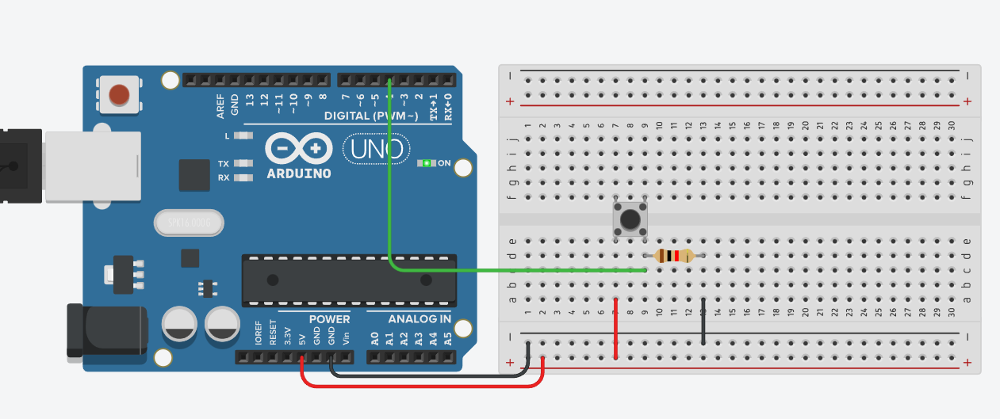

# Изучаем цифровой ввод - digitalRead:

digitalRead ~= проанализировать, подается или не подается сигнал на пин, т.е. приходит на него 5 вольт или не приходит.

Пример: по нажатию кнопки зажигаем встроенный светодиод ардуинки

