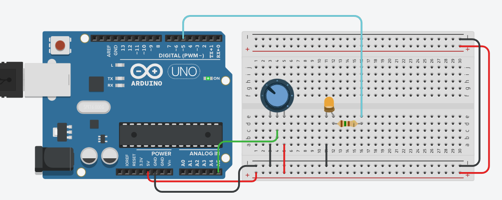
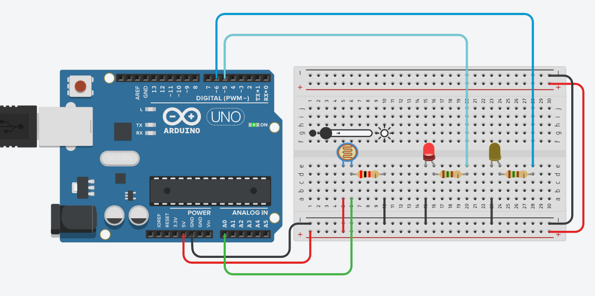

# Изучаем аналоговый ввод - analogWrite:

analogWrite ~= считать, сколько вольт подается на пин (от 0 до 5 вольт).

1) собираем схему и пишем программу для управления яркостью светодиода с помощью потенциометра

2) собираем схему и пишем программу для управления яркостью светодиодов (инверсно) с помощью фоторезистора

