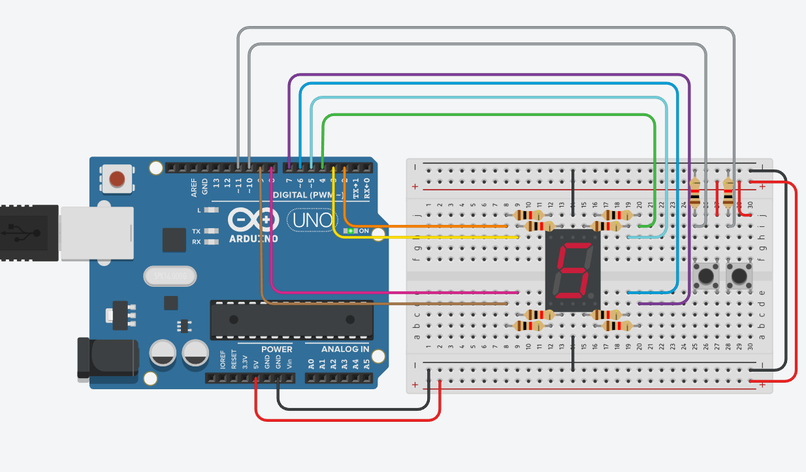

# Изучаем семисегментный индикатор:

в схеме используется !катодный! семисегментый индикатор

схема:

1) собрать схему и написать программу, чтобы наиндикаторе по очереди отображались все цифры (от 0 до 9 в цикле)
2) модифицировать схему (добавить две кнопки) и программу, чтобы при нажатии на одну кнопку значение на индикаторе увеличивалось, а при нажатии на другую кнопку уменьшалось

