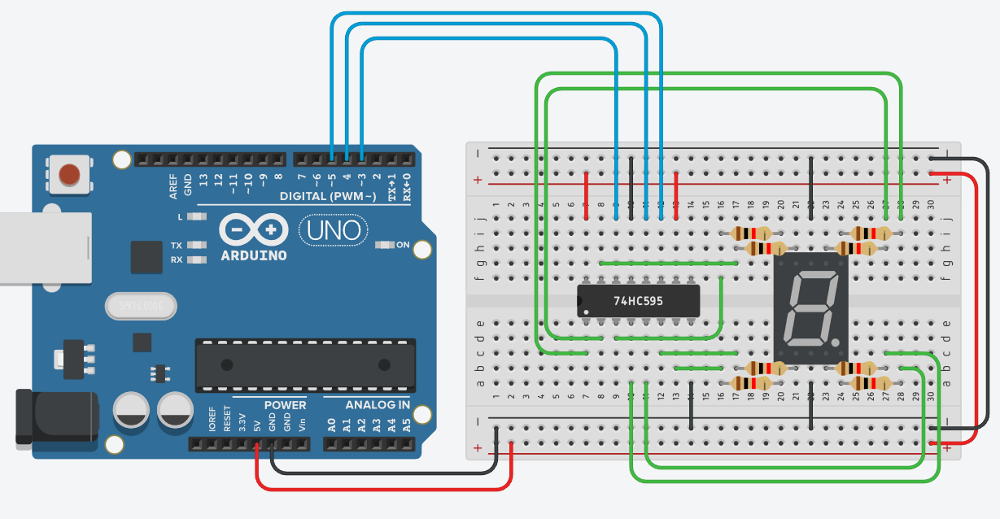

# Изучаем сдвиговый регистр на примере управления семисегментного индикатора:

в схеме используется !катодный! семисегментый индикатор

схема:

Задача: собрать схему и написать программу, чтобы наиндикаторе по очереди отображались все цифры (от 0 до 9 в цикле)

