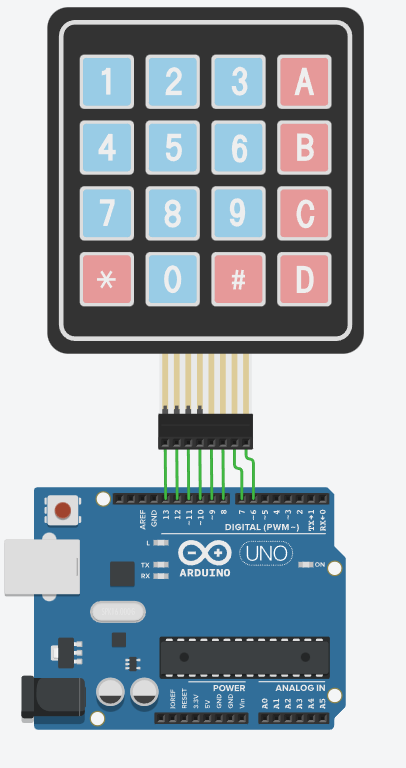

# Изучаем работу с матричной клавиатурой 4х4

схема:

Задача: собрать схему и написать программу, чтобы в монитор последовательного интерфейса (монитор порта) выводилась информация о нажатой на клавиатуре кнопке, с визуализацией местоположения этой кнопки

