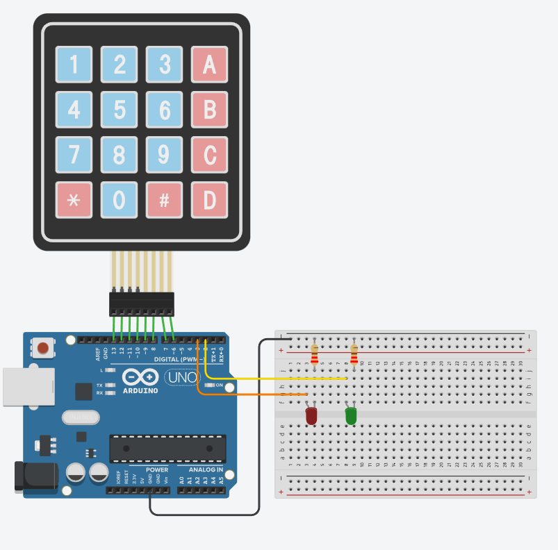

# Изучаем работу с матричной клавиатурой 4х4

схема:

Задача: Разработать когдовый замок. Собрать схему и написать программу, чтобы при вводе правильного кода загорался зеленый светодиод, а после ввода неправильного кода - красный. Кнопка 'D' является кнопкой enter (завершением ввода пароля) 

