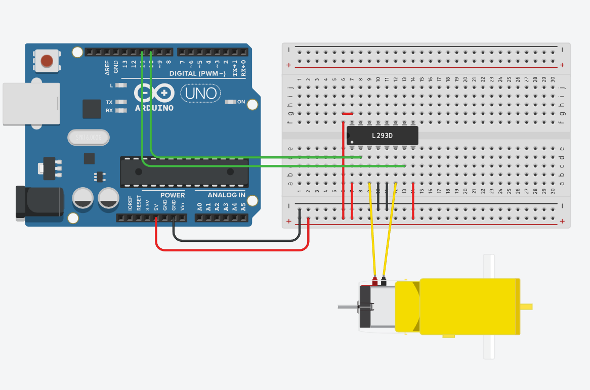

# Изучаем микросхему с H мостом (L293D)

схема:

Задача: с помощью микросхемы двух H мостов (L293D) плавно запускать двигатель в разные стороны

# ссылки по теме:
https://arduinomaster.ru/uroki-arduino/shema-raboty-n-mosta-dlya-upravleniya-dvigatelyami/

