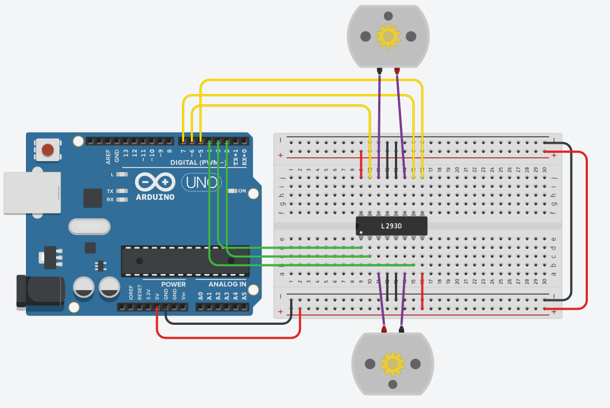

# Изучаем работу с миркросхемой L293D

схема:

Задача: собрать схему и написать программу, чтобы с помощью микросхемы L293D можно было управлять 2-мя моторами с помощью которких комманд (подпрограмм)

