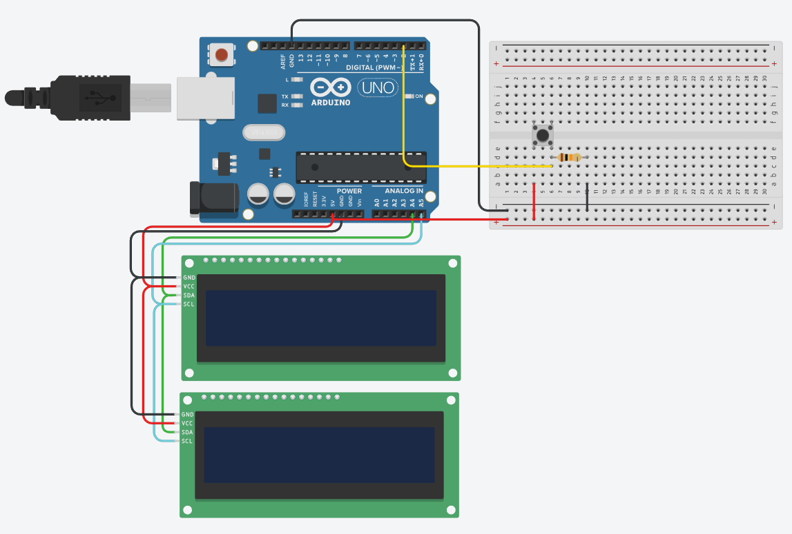

# Изучаем работу с I2C дисплеями и написание игры динозаврик из браузера хром

схема:

Задача: собрать схему и написать программу, чтобы устройство выводило на экран игру динозаврик из хрома, а на второй счет игры. при нажатии на кнопку динозаврик должнен подпрыгивать.

Уточнение по работе с экранами: т.к. экраны управляются по протоколу I2C, то у каждого из них должен быть уникальный I2C адрес, в данном примере у одного экрана адрес 32, а у второго 33 (при нажатии на экран выскакивает меню с настройками адреса) 

