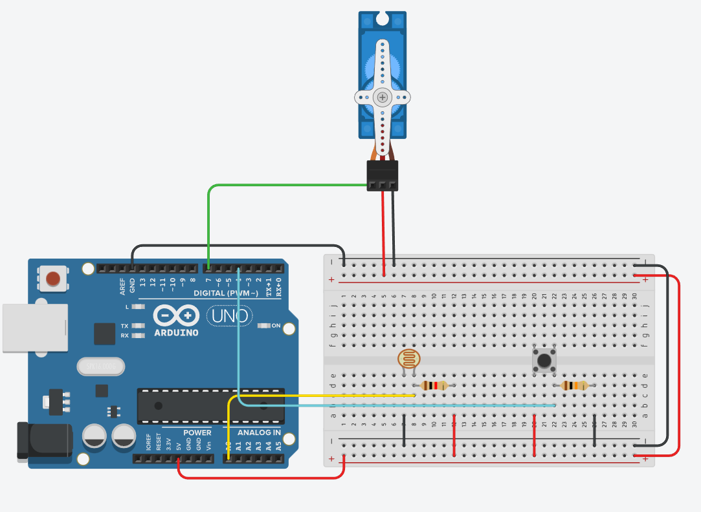

# Изучаем работу с сервомотором

схема:

.
Задача: Создать турникет метро старого образца: Двери турникета (серва) открыты, в момент пробегания "зайца" (фиксирует фоторезистор) турникет закрывается, пока "заяц" не покинет его. Если человек, перед проходом турникета, приложил карту (в нашем случае нажал на кнопку) то турникет его пропускает.
