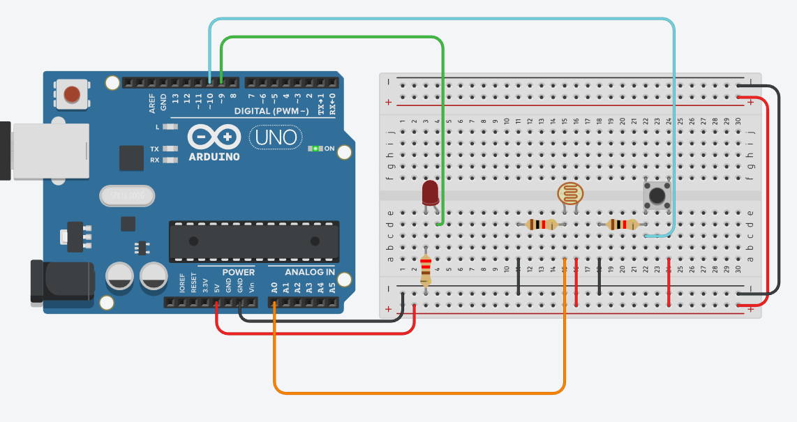

# Тренировочное задание для допуска

схема:

Задание для самоподготовки к Допуску: (делается в тинкеркаде)
Предыстория: В офисе решили установить охранную систему, которая не работает днем (не реагирует на сотрудников) и реагирует ночью.
Задача: Разработать устройство, которое находится в проеме двери, реагирующее на проходящих людей. У устройства есть два режима работы, которые переключаются кнопкой. В пером режиме (режим сна) устройсто не реагирует ни на что (кроме кнопки переключения режима). Во втором режиме (охранном) устройство реагирует на проходящих через дверь людей (с помощью фоторезистора, кнопки (второй), или другого датчика), и если кто-то прошел, оно начинает мигать светодиодом (или другим способом индицировать несанкционированный проход).
Критерии оценивания (максимум 10 баллов):
1) В "режиме сна" устройство не реагирует на датчик - 2 балла
2) В "охранном" режиме устройство реагирует на датчик - 3 балла
3) Режимы переключаются по кнопке - 3 балл
4) Схема собрана аккуратно - 1 балл
5) Код написан аккуратно - 1 балл
