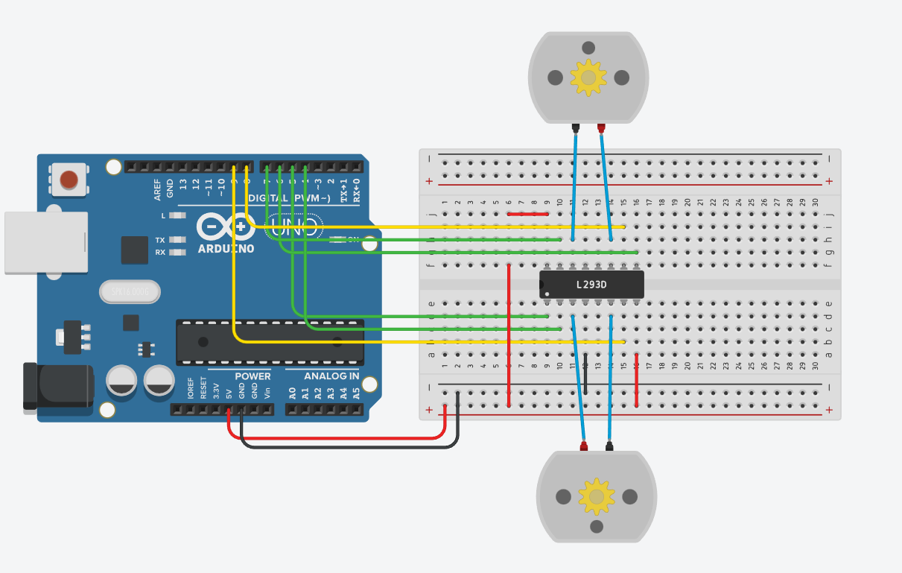

# Изучаем работу с millis

схема:

Задача: Сделать задачу 2 (из допуска) без задержек (во время нажатий на кнопку).

Задача 2 (допуск):

Предыстория: Вам поручили разработать «будильник для разминок»,
устройство, которое напоминает сделать разминку. Будильник стоит
на столе, где работает (например) Вася. Когда Вася садится, он
нажимает на кнопку на «будильнике». Через некоторое время (5
секунд) будильник индицирует Васе, что он должен сделать разминку.
Индикация происходит до того момента, пока Вася не нажмет на
кнопку (т.е. пойдет делать разминку). После этого будильник ждет
следующего нажатия на кнопку (пока Вася вернется за стол).

Задача: Разработать устройство, которое после нажатия на кнопку
ждет пять секунд, после чего начинает индицировать (например
мигать светодиодом), до тех пор, пока не нажмут на кнопку (ту же).
Затем устройство ждет следующего нажатия на кнопу, чтобы
запустить таймер (программа работает в цикле).
*уточнение – устройством ввода в этом задании является ОДНА
кнопка
